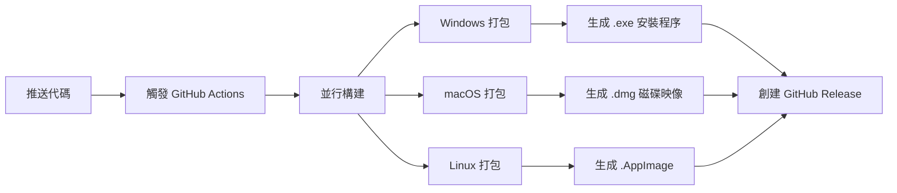

# 多平台打包指南

本文檔說明如何為 **Windows、macOS 和 Linux** 三個平台打包和發布 Basler Vision System。

---

## 📋 目錄

- [快速開始](#快速開始)
- [打包方式對比](#打包方式對比)
- [方式 1：GitHub Actions 自動打包（推薦）](#方式-1github-actions-自動打包推薦)
- [方式 2：本地手動打包](#方式-2本地手動打包)
- [打包產物說明](#打包產物說明)
- [常見問題](#常見問題)

---

## 快速開始

### 🚀 最簡單的方式：使用 GitHub Actions

1. 推送代碼到 GitHub
2. 前往 **Actions** 標籤
3. 選擇 **Build Multi-Platform Release** 工作流
4. 點擊 **Run workflow**
5. 輸入版本號（如 `2.0.3`）
6. 等待 15-20 分鐘
7. 下載生成的安裝包（Windows .exe、macOS .dmg、Linux .AppImage）

---

## 打包方式對比

| 方式 | 優點 | 缺點 | 適用場景 |
|------|------|------|----------|
| **GitHub Actions** | ✅ 自動化<br>✅ 同時生成三平台<br>✅ 無需本地環境<br>✅ 可重複性高 | ⚠️ 需要 GitHub 帳號<br>⚠️ 需要等待構建 | **推薦用於正式發布** |
| **本地手動打包** | ✅ 即時反饋<br>✅ 不依賴網路<br>✅ 完全控制 | ⚠️ 需要多台機器<br>⚠️ 環境配置複雜<br>⚠️ 手動操作繁瑣 | 快速測試、特殊需求 |

---

## 方式 1：GitHub Actions 自動打包（推薦）

### 工作流程概覽



### 步驟 1：準備 GitHub 倉庫

確保以下文件已提交到倉庫：

```bash
.github/workflows/build-release.yml    # ✅ GitHub Actions 配置
installer/windows_installer.iss        # ✅ Windows 安裝程序配置
scripts/build.py                       # ✅ 打包腳本
basler_pyqt6.spec                      # ✅ PyInstaller 配置
requirements.txt                       # ✅ 依賴清單
```

### 步驟 2：觸發自動構建

#### 方法 A：手動觸發（推薦）

1. 前往 GitHub 倉庫頁面
2. 點擊 **Actions** 標籤
3. 選擇左側的 **Build Multi-Platform Release**
4. 點擊右上角 **Run workflow**
5. 填寫參數：
   - **版本號**：例如 `2.0.3`
   - **是否創建 Release**：勾選（會自動創建 GitHub Release）
6. 點擊 **Run workflow** 確認

#### 方法 B：推送標籤觸發（自動化）

```bash
# 創建版本標籤
git tag -a v2.0.3 -m "Release version 2.0.3"

# 推送標籤到 GitHub
git push origin v2.0.3
```

**自動觸發構建流程**，約 15-20 分鐘後完成。

### 步驟 3：下載構建產物

#### 方式 A：從 Artifacts 下載（測試用）

1. 前往 **Actions** 標籤
2. 點擊最近的工作流運行
3. 滾動到底部 **Artifacts** 區域
4. 下載對應平台的壓縮包：
   - `BaslerVision-Windows-v2.0.3.zip`
   - `BaslerVision-macOS-v2.0.3.zip`
   - `BaslerVision-Linux-v2.0.3.zip`

#### 方式 B：從 Releases 下載（正式發布）

1. 前往倉庫首頁
2. 點擊右側 **Releases**
3. 找到對應版本（如 `v2.0.3`）
4. 下載安裝包：
   - **Windows**: `BaslerVision_Setup_v2.0.3.exe`
   - **macOS**: `BaslerVision_v2.0.3_macOS.dmg`
   - **Linux**: `BaslerVision_v2.0.3_Linux.AppImage`

### 步驟 4：驗證安裝包

在對應平台上測試安裝：

#### Windows 測試
```powershell
# 下載 .exe 後雙擊安裝
# 或使用命令行靜默安裝
BaslerVision_Setup_v2.0.3.exe /VERYSILENT /NORESTART
```

#### macOS 測試
```bash
# 掛載 DMG
hdiutil attach BaslerVision_v2.0.3_macOS.dmg

# 複製到 Applications
cp -R "/Volumes/Basler Vision System/BaslerVisionSystem.app" /Applications/

# 卸載 DMG
hdiutil detach "/Volumes/Basler Vision System"
```

#### Linux 測試
```bash
# 添加執行權限
chmod +x BaslerVision_v2.0.3_Linux.AppImage

# 直接運行
./BaslerVision_v2.0.3_Linux.AppImage
```

---

## 方式 2：本地手動打包

### 前提條件

| 平台 | 要求 |
|------|------|
| **Windows** | Windows 10/11 x64<br>Python 3.12<br>Inno Setup 6+ |
| **macOS** | macOS 11+ (Big Sur)<br>Python 3.12<br>create-dmg (Homebrew) |
| **Linux** | Ubuntu 20.04+ / Debian 11+<br>Python 3.12<br>linuxdeploy |

### Windows 本地打包

#### 1. 安裝環境

```powershell
# 安裝 Python 3.12
# 下載: https://www.python.org/downloads/

# 安裝依賴
pip install -r requirements.txt

# 安裝 Inno Setup
# 下載: https://jrsoftware.org/isdl.php
# 使用 Chocolatey 安裝（推薦）
choco install innosetup -y
```

#### 2. 執行打包

```powershell
# 方式 A：完整打包（含安裝程序）
python scripts/build.py

# 方式 B：僅 PyInstaller 打包（不創建安裝程序）
python scripts/build.py --no-installer

# 查看平台信息
python scripts/build.py --show-platform
```

#### 3. 輸出位置

```
releases/
├── BaslerVision_Setup_v2.0.3.exe       # ✅ Windows 安裝程序
├── BaslerVision_v2.0.3_*.zip           # 壓縮包（備用）
└── BaslerVision_v2.0.3_*_info.json     # 版本信息
```

### macOS 本地打包

#### 1. 安裝環境

```bash
# 安裝 Homebrew（如果未安裝）
/bin/bash -c "$(curl -fsSL https://raw.githubusercontent.com/Homebrew/install/HEAD/install.sh)"

# 安裝 Python 3.12
brew install python@3.12

# 安裝依賴
pip3 install -r requirements.txt

# 安裝 create-dmg
brew install create-dmg
```

#### 2. 執行打包

```bash
# PyInstaller 打包
python3 scripts/build.py --no-installer

# 手動創建 DMG（需要在 macOS 上）
cd dist
create-dmg \
  --volname "Basler Vision System" \
  --window-pos 200 120 \
  --window-size 800 400 \
  --icon-size 100 \
  --app-drop-link 600 185 \
  "../releases/BaslerVision_v2.0.3_macOS.dmg" \
  "BaslerVisionSystem.app"
```

**注意**：macOS 打包建議使用 GitHub Actions，本地創建 DMG 需要複雜的 .app 結構配置。

### Linux 本地打包

#### 1. 安裝環境

```bash
# 安裝系統依賴
sudo apt-get update
sudo apt-get install -y \
    python3.12 \
    python3.12-venv \
    libxcb-xinerama0 \
    libxcb-cursor0 \
    libxkbcommon-x11-0

# 安裝 Python 依賴
pip3 install -r requirements.txt

# 安裝 linuxdeploy
wget https://github.com/linuxdeploy/linuxdeploy/releases/download/continuous/linuxdeploy-x86_64.AppImage
chmod +x linuxdeploy-x86_64.AppImage
```

#### 2. 執行打包

```bash
# PyInstaller 打包
python3 scripts/build.py --no-installer

# 手動創建 AppImage
# （參考 .github/workflows/build-release.yml 中的 Linux 構建步驟）
```

**注意**：Linux AppImage 創建複雜，強烈建議使用 GitHub Actions。

---

## 打包產物說明

### 文件結構

```
releases/
├── Windows/
│   ├── BaslerVision_Setup_v2.0.3.exe          # 🎯 Windows 安裝程序 (推薦分發)
│   ├── BaslerVision_v2.0.3_20251022_*.zip     # 便攜版壓縮包
│   └── BaslerVision_v2.0.3_*_info.json        # 版本元數據
│
├── macOS/
│   ├── BaslerVision_v2.0.3_macOS.dmg          # 🎯 macOS 磁碟映像 (推薦分發)
│   └── BaslerVision_v2.0.3_*_info.json
│
└── Linux/
    ├── BaslerVision_v2.0.3_Linux.AppImage     # 🎯 Linux 應用映像 (推薦分發)
    └── BaslerVision_v2.0.3_*_info.json
```

### 版本信息 JSON 格式

```json
{
  "version": "2.0.3",
  "build_type": "release",
  "timestamp": "20251022_153045",
  "filename": "BaslerVision_Setup_v2.0.3.exe",
  "file_size": 175234567,
  "md5": "a1b2c3d4e5f6...",
  "platform": "Windows",
  "installer": "releases/BaslerVision_Setup_v2.0.3.exe"
}
```

---

## 常見問題

### Q1: GitHub Actions 構建失敗怎麼辦？

**A**: 常見原因：

1. **依賴安裝失敗**
   - 檢查 `requirements.txt` 是否正確
   - 查看 Actions 日誌中的錯誤信息

2. **PyInstaller 打包錯誤**
   - 確認 `basler_pyqt6.spec` 配置正確
   - 檢查是否有隱藏導入缺失

3. **權限問題**
   - 確保倉庫有正確的 Actions 權限
   - 檢查 `GITHUB_TOKEN` 是否有效

**解決方法**：
```bash
# 在本地先測試打包
python scripts/build.py --no-package

# 查看詳細日誌
# 前往 GitHub Actions 頁面 > 點擊失敗的運行 > 查看詳細步驟日誌
```

### Q2: 如何修改 Windows 安裝程序的外觀？

**A**: 編輯 `installer/windows_installer.iss`：

```ini
; 修改應用名稱
#define MyAppName "您的應用名稱"

; 修改圖標
SetupIconFile=..\resources\icon.ico

; 修改安裝目錄
DefaultDirName={autopf}\YourAppName

; 修改語言
[Languages]
Name: "chinesetraditional"; MessagesFile: "compiler:Languages\ChineseTraditional.isl"
```

### Q3: macOS 打包後提示「應用程式已損壞」？

**A**: 這是 macOS Gatekeeper 安全機制。解決方法：

```bash
# 方式 1：簽名應用程式（需要 Apple Developer 帳號）
codesign --force --deep --sign "Developer ID" BaslerVisionSystem.app

# 方式 2：使用者手動允許（臨時方案）
# 系統偏好設定 > 安全性與隱私 > 允許從以下位置下載的 App > 任何來源

# 方式 3：移除隔離屬性
xattr -cr BaslerVisionSystem.app
```

### Q4: Linux AppImage 無法運行？

**A**: 常見原因：

1. **缺少執行權限**
   ```bash
   chmod +x BaslerVision*.AppImage
   ```

2. **缺少 FUSE 支援**
   ```bash
   # Ubuntu/Debian
   sudo apt-get install fuse libfuse2

   # 或使用 --appimage-extract 解壓運行
   ./BaslerVision*.AppImage --appimage-extract
   ./squashfs-root/AppRun
   ```

3. **環境變量問題**
   ```bash
   # 清除 LD_LIBRARY_PATH
   unset LD_LIBRARY_PATH
   ./BaslerVision*.AppImage
   ```

### Q5: 如何為不同平台設置不同的配置？

**A**: 在代碼中使用平台檢測：

```python
import platform

if platform.system() == 'Windows':
    # Windows 特定配置
    config_path = Path(os.getenv('APPDATA')) / 'BaslerVision'
elif platform.system() == 'Darwin':
    # macOS 特定配置
    config_path = Path.home() / 'Library/Application Support/BaslerVision'
else:
    # Linux 特定配置
    config_path = Path.home() / '.config/BaslerVision'
```

### Q6: 如何減小安裝包大小？

**A**: 優化方法：

1. **排除不需要的庫**（在 `basler_pyqt6.spec` 中）：
   ```python
   excludes=[
       'matplotlib',
       'pandas',
       'scipy',
       'tkinter',
       'test',
       'unittest',
   ]
   ```

2. **啟用 UPX 壓縮**：
   ```python
   upx=True,
   upx_exclude=[],
   ```

3. **移除測試資料**：
   ```python
   # 註釋掉大型測試文件
   # ('basler_pyqt6/testData', 'testData'),
   ```

### Q7: 如何添加新平台支援？

**A**: 需要修改的文件：

1. **`.github/workflows/build-release.yml`**：添加新平台的 matrix 配置
2. **`scripts/build.py`**：添加平台檢測和打包邏輯
3. **`installer/`**：創建新平台的安裝程序配置

---

## 📚 相關文檔

- [PyInstaller 官方文檔](https://pyinstaller.org/)
- [Inno Setup 文檔](https://jrsoftware.org/ishelp/)
- [create-dmg GitHub](https://github.com/create-dmg/create-dmg)
- [linuxdeploy 文檔](https://docs.appimage.org/packaging-guide/index.html)
- [GitHub Actions 文檔](https://docs.github.com/actions)

---

## 🔧 高級配置

### 自定義構建腳本

如果需要更複雜的構建邏輯，可以擴展 `scripts/build.py`：

```python
class CustomBuilder(AppBuilder):
    def post_build_hook(self):
        """構建後自定義處理"""
        # 例如：複製額外文件、生成文檔等
        pass

    def pre_installer_hook(self):
        """安裝程序創建前處理"""
        # 例如：簽名、公證（macOS）
        pass
```

### CI/CD 整合

將構建流程整合到現有 CI/CD 管道：

```yaml
# 例如：整合到 Jenkins
stages:
  - build
  - test
  - deploy

build-windows:
  stage: build
  script:
    - python scripts/build.py
  artifacts:
    paths:
      - releases/*.exe
```

---

## 📞 支援

如遇到問題，請：

1. 查看 [常見問題](#常見問題) 章節
2. 檢查 GitHub Actions 日誌
3. 提交 [Issue](https://github.com/your-repo/issues)

---

**最後更新**: 2025-10-22
**維護者**: Basler Industrial Vision Team
