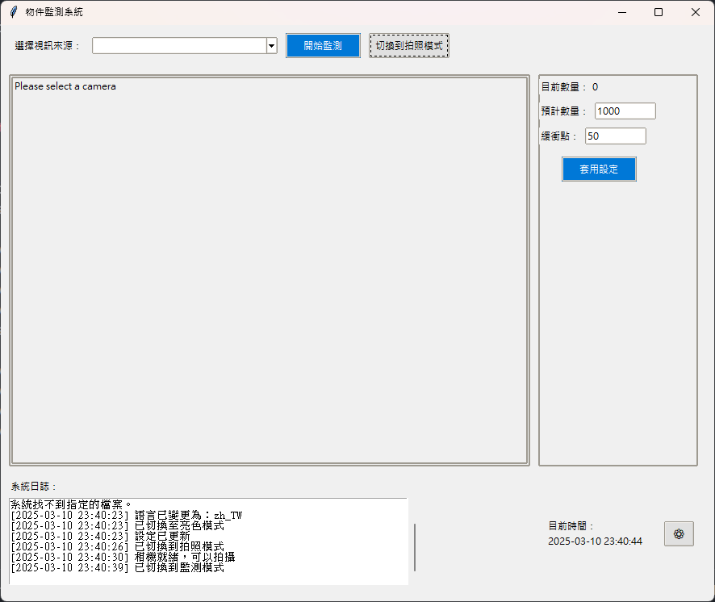
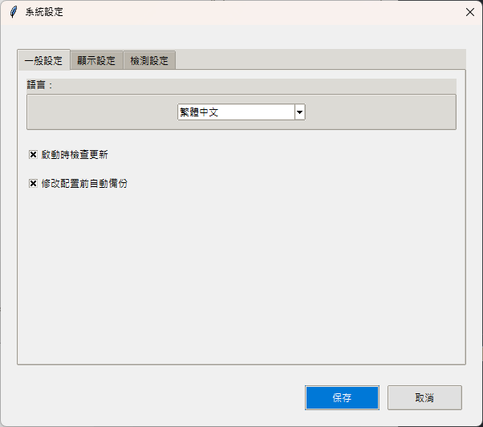

# 即時物件監測系統（Real-time Item Monitoring System）

這是一個使用 Python 開發的即時物件監測系統，專門用於工業生產線上的物件即時檢測和計數。系統提供圖形使用者介面，支援攝像頭即時監測和預先錄製的視頻分析，並新增了產品拍照檢測分析功能。

## 系統環境

- Python 3.10
- 虛擬環境：RPi_4_camera

## 使用者介面

系統使用者介面採用簡潔、直觀的設計，主要分為以下幾個區域：



1. **控制區域**（頂部）

   - 視訊來源選擇下拉選單
   - 開始/停止監測按鈕
   - 模式切換按鈕

2. **視訊顯示區域**（左側）

   - 即時視訊顯示
   - ROI 檢測線（可拖動調整）
   - 物件計數和 FPS 顯示

3. **設定區域**（右側）

   - 目前數量顯示
   - 預計數量設定
   - 緩衝點設定
   - 套用設定按鈕

4. **日誌區域**（底部）
   - 系統操作日誌
   - 當前時間顯示

系統支援兩種主要模式：

- **監測模式**：用於即時物件檢測和計數
- **拍照模式**：用於產品拍照和分析

## 設定介面



設定介面採用標籤頁設計，分為三個主要部分，提供直觀且全面的系統配置選項：

1. **一般設定**

   - **語言選擇**：支援繁體中文、英文和簡體中文三種語言，可根據使用者偏好隨時切換
   - **自動檢查更新**：啟動時自動檢查系統更新，確保使用最新版本
   - **配置自動備份**：修改配置前自動備份，防止誤操作導致設定丟失

2. **顯示設定**

   - **主題選擇**：提供亮色模式和暗色模式兩種主題，適應不同工作環境
   - **字體大小**：可選擇小、中、大三種字體大小，提升閱讀舒適度
   - **效能資訊顯示**：開啟或關閉系統效能資訊（如 FPS）的顯示

3. **檢測設定**

   - **預設檢測參數**：
     - 預計數量：設定目標檢測數量
     - 緩衝點：設定警告閾值，達到此數量時發出提醒
     - ROI 預設位置：設定檢測線的預設位置（百分比）
   - **物件面積範圍**：
     - 最小面積：過濾掉小於此面積的雜訊
     - 最大面積：過濾掉大於此面積的干擾物

4. **拍照分析設定**（計劃中的功能）
   - **API 端點設定**：配置後端分析服務的連接地址
   - **分析品質閾值**：設定產品品質判定的標準閾值
   - **照片自動保存**：設定是否自動保存拍攝的照片及保存路徑
   - **圓形物體檢測**：調整圓形物體檢測的參數，如靈敏度和最小/最大半徑

所有設定會即時保存到配置文件，並在下次啟動時自動載入。使用者可以通過點擊主界面右上角的設定圖標隨時進入設定界面進行調整。

## 程式碼流程說明

### 系統啟動流程

1. **程式入口**：
   - `main.py` -> `main()` 函數：初始化系統，創建主視窗和控制器

2. **初始化過程**：
   - `main.py` -> `main()` -> `MainWindow(root)` (`views/main_window.py`)：創建主視窗
   - `main.py` -> `main()` -> `SystemController(main_window)` (`controllers/system_controller.py`)：創建系統控制器
   - `main.py` -> `main()` -> `main_window.set_system_controller(system_controller)`：將系統控制器設置到主視窗

3. **相機初始化**：
   - `main.py` -> `main()` -> `system_controller.camera_manager.get_available_sources()`：獲取可用相機
   - `main.py` -> `main()` -> `system_controller.handle_camera_open(default_camera)`：自動打開默認相機

### 監測模式功能流程

1. **開始監測**：
   - 用戶點擊「開始」按鈕 -> `views/components/control_panel.py` -> `_on_start_button_click()` 
   - -> `controllers/system_controller.py` -> `handle_start()` 
   - -> `start_monitoring(source)` 
   - -> `detection_controller.start_detection()`

2. **停止監測**：
   - 用戶點擊「停止」按鈕 -> `views/components/control_panel.py` -> `_on_stop_button_click()` 
   - -> `controllers/system_controller.py` -> `handle_stop()` 
   - -> `stop_current_operation()` 
   - -> `detection_controller.stop_detection()`

3. **視頻幀處理**：
   - `controllers/system_controller.py` -> `update_video_frame()` 
   - -> `camera_manager.read_frame()` (`models/camera_manager.py`) 
   - -> `detection_controller.process_frame(frame)` (`controllers/detection_controller.py`) 
   - -> `main_window.video_panel.update_image(processed_frame)` (`views/components/video_panel.py`)

4. **ROI 線調整**：
   - 用戶拖動 ROI 線 -> `views/components/video_panel.py` -> `_on_canvas_drag()` 
   - -> `controllers/system_controller.py` -> `handle_roi_selection(event)` 
   - -> `detection_controller.update_roi_position(event)` (`controllers/detection_controller.py`)

### 拍照模式功能流程

1. **切換到拍照模式**：
   - 用戶點擊「拍照模式」按鈕 -> `views/components/control_panel.py` -> `_on_mode_switch()` 
   - -> `controllers/system_controller.py` -> `handle_mode_switch(mode)` 
   - -> `main_window.switch_mode("photo")` (`views/main_window.py`)

2. **開始拍照預覽**：
   - 用戶點擊「開始」按鈕 -> `views/components/control_panel.py` -> `_on_start_button_click()` 
   - -> `controllers/system_controller.py` -> `handle_start()` 
   - -> `start_photo_mode(source)` 
   - -> `update_photo_preview()`

3. **拍攝照片**：
   - 用戶點擊「拍攝」按鈕 -> `views/components/photo_panel.py` -> `_on_capture_button_click()` 
   - -> `controllers/system_controller.py` -> `handle_photo_capture()` 
   - -> `main_window.photo_panel.update_photo_preview(frame)` (`views/components/photo_panel.py`)

4. **分析照片**：
   - 用戶點擊「分析」按鈕 -> `views/components/photo_panel.py` -> `_on_analyze_button_click()` 
   - -> `controllers/system_controller.py` -> `handle_photo_analysis()` 
   - -> `detection_controller.process_frame(current_photo)` (`controllers/detection_controller.py`) 
   - -> `main_window.photo_panel.update_photo_preview(result_frame)` (`views/components/photo_panel.py`)

### 設定功能流程

1. **打開設定對話框**：
   - 用戶點擊「設定」按鈕 -> `views/components/control_panel.py` -> `_on_settings_button_click()` 
   - -> `controllers/system_controller.py` -> `handle_settings_button()` 
   - -> `_on_settings()` 
   - -> `SettingsDialog(self.main_window, config_manager)` (`views/components/setting/settings_dialog.py`)

2. **套用設定**：
   - 用戶點擊「套用設定」按鈕 -> `views/components/settings_panel.py` -> `_on_apply_settings()` 
   - -> `controllers/system_controller.py` -> `handle_apply_settings(settings)` 
   - -> `detection_controller.set_target_count(target_count)` 和 `detection_controller.set_buffer_point(buffer_point)` 
   - -> `save_settings()` 
   - -> `main_window.settings_panel.update_ui()` 或 `main_window.settings_panel.recreate_ui()`

3. **語言切換**：
   - 用戶在設定對話框中選擇語言 -> `views/components/setting/settings_dialog.py` -> `_on_language_changed()` 
   - -> `controllers/system_controller.py` -> `handle_language_change(language_code)` 
   - -> `main_window.on_language_changed(language_code)` (`views/main_window.py`) 
   - -> 各組件的 `update_language()` 方法

4. **主題切換**：
   - 用戶在設定對話框中選擇主題 -> `views/components/setting/settings_dialog.py` -> `_on_theme_changed()` 
   - -> `controllers/system_controller.py` -> `handle_theme_change(theme_name)` 
   - -> `apply_dark_theme()` 或 `apply_light_theme()`

### 數據流程

1. **相機數據流**：
   - `models/camera_manager.py` -> `read_frame()` 
   - -> `controllers/detection_controller.py` -> `process_frame(frame)` 
   - -> `models/image_processor.py` -> 各種圖像處理方法 
   - -> 返回處理後的幀到 `detection_controller` 
   - -> 返回到 `system_controller` 
   - -> `views/components/video_panel.py` 或 `views/components/photo_panel.py` 顯示

2. **設定數據流**：
   - `utils/config.py` -> 讀取/寫入配置文件 
   - -> `controllers/system_controller.py` -> `load_settings()` 和 `save_settings()` 
   - -> 更新到 `detection_controller` 和 UI 組件

3. **計數數據流**：
   - `controllers/detection_controller.py` -> `process_frame()` 中的物件計數 
   - -> 通過回調函數 `count_updated` 
   - -> `views/components/settings_panel.py` -> `update_count(count)` 更新顯示

## 目錄結構

```plaintext
Real-time_item_monitoring_system/
│
├── main.py                 # 主程式入口
├── requirements.txt        # 專案依賴
│
├── models/                 # Model 層 - 處理資料和業務邏輯
│   ├── __init__.py
│   ├── system_config.py    # 系統配置
│   ├── image_processor.py  # 影像處理
│   ├── camera_manager.py   # 攝影機管理
│   └── api_client.py       # API客戶端 - 與後端通信
│
├── views/                  # View 層 - 使用者介面
│   ├── __init__.py
│   ├── ui_manager.py       # UI 樣式管理
│   ├── main_window.py      # 主視窗
│   └── components/         # UI 元件
│       ├── __init__.py
│       ├── control_panel.py        # 控制面板
│       ├── video_panel.py          # 影像顯示面板
│       ├── settings_panel.py       # 設定面板
│       ├── photo_panel.py          # 拍照面板
│       ├── analysis_panel.py       # 分析結果面板
│       └── setting/
│           └── settings_dialog.py  # 設定對話框
│
├── controllers/            # Controller 層 - 控制邏輯
│   ├── __init__.py
│   ├── detection_controller.py    # 物件偵測控制器
│   └── system_controller.py       # 系統控制器
│
├── utils/                  # 工具類
│   ├── __init__.py
│   ├── logger.py           # 日誌工具
│   ├── config.py           # 配置管理
│   ├── exceptions.py       # 異常處理
│   ├── language.py         # 多語言支援
│   └── theme_manager.py    # 主題管理
│
├── config/                 # 配置目錄
│   └── config.yaml         # 系統配置檔
│
├── languages/              # 語言資源目錄
│   ├── zh_TW.json          # 繁體中文
│   ├── en_US.json          # 英文
│   └── zh_CN.json          # 簡體中文
│
├── icons/                  # 圖標資源目錄
│   └── settings.png        # 設定圖標
│
├── logs/                   # 日誌目錄
│   └── detection_*.log     # 系統日誌文件
│
├── docs/                   # 文檔目錄
│   └── images/             # 文檔圖片
│       └── ui_layout.png   # UI布局圖
│
├── captured_images/        # 拍攝照片保存目錄
│
├── README.md               # 項目說明文件
└── requirements.txt        # 依賴套件清單
```

## 主要功能

- 即時物件檢測和計數
- 支援多種視訊輸入源（攝像頭和預錄視頻）
- 可設定預期數量和警告閾值
- 自動物件追蹤
- 圖形化使用者介面，支援主題切換
- 多語言支援（繁體中文、英文、簡體中文）
- 設定的持久化存儲
- 完整的日誌記錄
- **拍照模式**：支援產品拍照和檢測分析
- **產品分析**：通過 API 與後端連接，實現產品品質檢測
- **多相機支援**：支援 USB 相機、Basler 工業相機和樹莓派 libcamera

## 技術特點

系統採用以下技術實現核心功能：

- 架構：嚴格的 MVC 架構設計
- 影像處理：使用 OpenCV 進行影像分析和物件檢測
- GUI：使用 Tkinter 建立圖形使用者介面
- 背景消除：採用 MOG2 算法識別移動物體
- 物件追蹤：基於連通區域分析實現物件追蹤
- 多執行緒：使用線程池確保 UI 響應性和處理效能
- 設定管理：YAML 格式配置持久化存儲
- 國際化：完整的多語言支援系統
- **相機管理**：自動檢測和管理多種類型的相機
- **模式切換**：支援監測模式和拍照模式的無縫切換
- **API 整合**：與後端 API 系統整合，實現產品分析功能
- **錯誤恢復**：增強的錯誤處理和自動恢復機制

## 安裝步驟

1. 建立並啟動虛擬環境：

```bash
    conda create -n RPi_4_camera python=3.10
    conda activate RPi_4_camera
```

2. 安裝依賴套件：

```bash
    pip install -r requirements.txt
```

3. 安裝 Basler 相機支援（可選）：

```bash
    pip install pypylon
```

## 使用說明

1. 啟動程式：

```bash
    python3 main.py
```

2. 打包執行檔：

```bash
    # 產生 spec 檔案
    pyinstaller --clean object_detection_system.spec
    # 執行打包後的程式，並將錯誤日誌導向到 logs 資料夾
    .\dist\object_detection_system.exe 2> logs\error.log

    # lixux 系統格式專用
    pyinstaller --onefile main.py
```

3. 物件監測模式操作流程：

   - 從下拉選單選擇視訊來源
   - 設定預期數量和緩衝點
   - 點擊「開始監測」按鈕開始處理
   - 點擊右上角設定圖標可進入系統設定
   - 系統會自動記住您的設定和偏好
   - 達到緩衝點時會發出警告
   - 達到預期數量時會自動停止並通知
   - 可拖動 ROI 線調整檢測位置

4. 拍照分析模式操作流程：
   - 點擊「切換到拍照模式」按鈕切換到拍照模式
   - 選擇相機源後，系統會自動顯示相機預覽
   - 點擊「拍攝照片」按鈕拍攝一張照片
   - 點擊「分析照片」按鈕將照片發送至後端 API 進行分析
   - 系統會顯示分析結果，包括輸入圖像、分析圖像、誤差圖等
   - 分析結果會顯示檢測狀態（正常/有缺陷）、檢測分數和平均誤差

## 系統設定

系統設定分為三個部分：

1. **一般設定**

   - 語言選擇（繁體中文、英文、簡體中文）
   - 啟動時自動檢查更新
   - 配置修改前自動備份

2. **顯示設定**

   - 主題選擇（亮色模式、暗色模式）
   - 字體大小（小、中、大）
   - 效能資訊顯示開關

3. **檢測設定**

   - 預計數量和緩衝點
   - ROI 預設位置（百分比）
   - 物件面積範圍（最小/最大）

4. **拍照分析設定**
   - API 端點設定
   - 分析品質閾值
   - 照片自動保存設定
   - 圓形物體檢測參數

所有設定都會自動保存到配置文件，下次啟動時自動套用。

## 系統參數

- ROI 檢測區域高度：16 像素（可配置）
- 物件面積範圍：10-150 像素 ²（可配置）
- 背景消除器參數：
  - 歷史幀數：20000
  - 閾值：16
  - 陰影檢測：開啟
- 追蹤容許誤差：
  - X 軸：64 像素
  - Y 軸：48 像素
- 視訊處理速率：最高支援 206 FPS
- 相機自動重連：支援自動重連斷線的相機
- 相機健康監控：自動監控相機狀態並嘗試恢復

## 日誌系統

- 自動在 logs 目錄創建日誌文件
- 日誌命名格式：detection_YYYYMMDD_HHMMSS.log
- 記錄內容包含：
  - 系統啟動/停止
  - 物件檢測結果
  - 錯誤訊息
  - 設定變更
  - 相機連接狀態
  - API 通信記錄

## 開發說明

- 開發環境：Python 3.10
- 專案管理：使用 Git 進行版本控制
- 代碼風格：遵循 PEP 8 規範
- 測試環境：Windows 系統，預計部署於樹莓派 4B
- 代碼組織：功能模組化，結構清晰
- 錯誤處理：完善的異常處理機制
- 擴展性：易於添加新功能和支援新設備

## 授權說明

本項目採用 MIT 授權條款。您可以自由使用、修改和分發本程式碼，但請保留原作者資訊。
